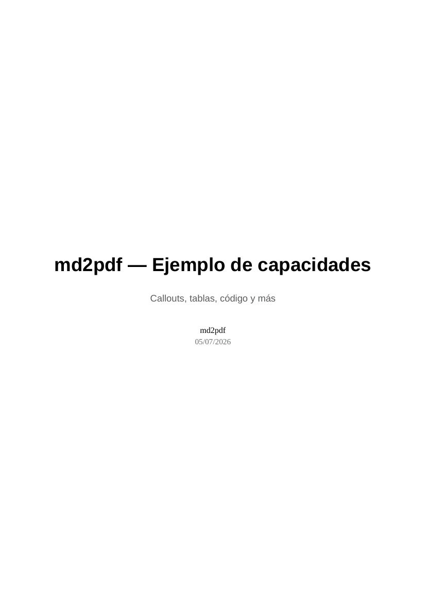

# md2pdf

Convertí Markdown técnico (el que suele salir de un LLM: código, tablas, notas al pie, callouts) en un **PDF profesional y cómodo de leer** — tipografía cuidada, saltos de página, bloques de código resaltados, avisos tipo GitHub, portada y tabla de contenidos opcionales, y un modo pensado para e-readers.

Motor: [Pandoc](https://pandoc.org/) parsea el Markdown → [Typst](https://typst.app/) lo tipografía y genera el PDF. Sin LaTeX, sin Chromium: dos binarios livianos.



## Contenido de este repo

| Archivo         | Para qué sirve                                                        |
|------------------|------------------------------------------------------------------------|
| `md2pdf`         | Script principal (bash). Requiere `pandoc` y `typst` en el `PATH`.     |
| `Dockerfile`     | Imagen con pandoc + typst + fuentes + `md2pdf` ya adentro.             |
| `md2pdf.ps1`     | Wrapper para **Windows PowerShell** — corre todo vía Docker.           |
| `md2pdf.cmd`     | Wrapper para **Windows CMD** clásico — corre todo vía Docker.          |
| `md2pdf-docker`  | Wrapper (bash) para **macOS / Linux / WSL** — corre todo vía Docker.   |

No necesitás usar todos: elegí instalación nativa **o** Docker (ver abajo).

---

## Instalación

### Opción A — Nativa (pandoc + typst en el PATH)

Más rápida, sin capa de virtualización. Necesitás:

- **Pandoc ≥ 3.1** — instrucciones oficiales: https://pandoc.org/installing.html
- **Typst ≥ 0.12** — instrucciones oficiales: https://github.com/typst/typst#installation

Elegí el método que corresponda a tu SO/arquitectura (gestor de paquetes, binario prebuilt, `cargo install`, etc.) — las páginas oficiales se mantienen más al día que lo que podamos documentar acá.

> En Windows, `md2pdf` es un script bash: corrélo con Git Bash o WSL. Si no querés instalar nada de esto, usá la Opción B (Docker).

Después, en cualquier plataforma:
```bash
chmod +x md2pdf
sudo mv md2pdf /usr/local/bin/    # opcional, para tenerlo en el PATH
```

### Opción B — Docker (no instalás pandoc ni typst, solo Docker)

Ideal en Windows, o si no querés gestionar dependencias. Necesitás [Docker Desktop](https://www.docker.com/products/docker-desktop/) instalado y corriendo.

1. Clonar el repo y pararte en la carpeta.
2. Construir la imagen (una sola vez; las siguientes veces usa caché):
   ```bash
   docker build -t md2pdf:local .
   ```
3. Ejecutar:

   **Windows — PowerShell:**
   ```powershell
   .\md2pdf.ps1 doc.md --kindle -o salida.pdf
   ```
   (si PowerShell bloquea el script por política de ejecución: `powershell -ExecutionPolicy Bypass -File .\md2pdf.ps1 doc.md`)

   **Windows — CMD:**
   ```cmd
   md2pdf.cmd doc.md --kindle -o salida.pdf
   ```

   **macOS / Linux / WSL:**
   ```bash
   chmod +x md2pdf-docker
   ./md2pdf-docker doc.md --kindle -o salida.pdf
   ```

   **O directo, sin wrapper, en cualquier plataforma:**
   ```bash
   docker run --rm -v "${PWD}:/work" -w /work md2pdf:local doc.md --kindle -o salida.pdf
   ```

Los tres wrappers construyen la imagen automáticamente la primera vez si todavía no existe. Parate siempre en la carpeta donde está tu `.md` antes de correrlos (montan el directorio actual dentro del contenedor).

---

## Uso

```
md2pdf entrada.md [-o salida.pdf] [opciones]
```

### Opciones

| Flag                  | Descripción                                                        |
|-----------------------|---------------------------------------------------------------------|
| `-o, --output ARCHIVO`| PDF de salida (por defecto: mismo nombre que la entrada, con `.pdf`)|
| `--toc`               | Agrega tabla de contenidos                                          |
| `--title "TEXTO"`     | Genera portada con este título                                     |
| `--subtitle "TEXTO"`  | Subtítulo de portada                                               |
| `--author "TEXTO"`    | Autor en portada                                                   |
| `--date "TEXTO"`      | Fecha en portada (por defecto: hoy, si hay `--title`)              |
| `--paper a4\|letter`  | Tamaño de página (por defecto: `a4`)                                |
| `--sans`              | Cuerpo en tipografía sans en vez de serif                          |
| `--kindle`            | Optimiza el PDF para pantalla de e-reader (ver abajo)              |
| `--base-size N`       | Tamaño de fuente base en pt (por defecto: 11, o 10 en `--kindle`)  |
| `--keep`              | No borra el `.typ` intermedio (útil para depurar estilos)          |
| `-h, --help`          | Ayuda                                                               |
| `-v, --version`       | Versión                                                             |

### Modo `--kindle`

Pensado para leer en la pantalla chica de un e-reader: página de 90×120mm, márgenes mínimos, texto sin justificar (mejor legibilidad en columna angosta), sin numeración de página, código a tamaño reducido.

```bash
md2pdf manual.md --kindle -o manual_kindle.pdf
```

**Limitación conocida:** un PDF no reflowea. Un bloque de código con líneas muy largas puede cortarse en pantalla chica. Si necesitás reflow real (texto que se adapta al ancho de cualquier dispositivo), generá un EPUB en su lugar — pandoc lo hace nativo y no necesita Typst:
```bash
pandoc doc.md -o doc.epub
```

---

## Sintaxis especial que reconoce el Markdown

### Callouts (estilo GitHub)

```markdown
> [!NOTE]
> Información adicional relevante.

> [!TIP]
> Un consejo práctico.

> [!IMPORTANT]
> Algo que no hay que pasar por alto.

> [!WARNING]
> Puede causar problemas si se ignora.

> [!CAUTION]
> Riesgo de daño o pérdida de datos.
```

Cada uno se renderiza como una caja de color con su propio acento e icono de texto (NOTA / TIP / IMPORTANTE / ATENCIÓN / CUIDADO).

### Saltos de página

Cualquiera de estas dos formas, en su propia línea:
```markdown
\newpage
```
```markdown
<!-- pagebreak -->
```

### Todo lo demás de Markdown estándar

Tablas GFM, bloques de código con resaltado de sintaxis (por el lenguaje declarado, ej. ` ```python `), notas al pie (`[^1]`), listas anidadas, negrita/cursiva/`código inline`, encabezados hasta nivel 3 con jerarquía tipográfica propia.

---

## Ejemplos

Documento simple:
```bash
md2pdf notas.md
```

Con portada y TOC:
```bash
md2pdf informe.md --title "Informe de arquitectura" --subtitle "Q3 2026" \
  --author "Daniel" --toc -o informe_final.pdf
```

Para leer en Kindle:
```bash
md2pdf tutorial.md --kindle --author "Daniel"
```

Papel carta, cuerpo sans, letra más grande:
```bash
md2pdf reporte.md --paper letter --sans --base-size 12
```

Depurar el estilo (queda el `.typ` intermedio para tocarlo a mano):
```bash
md2pdf doc.md --keep
```

---

## Personalización del estilo

Todo el diseño (fuentes, tamaños, colores de los callouts, márgenes, estilo de tabla y de bloques de código) vive en un único lugar dentro del script: el heredoc `preamble.typ` en `md2pdf`. Es Typst puro — se edita ahí y el cambio aplica a todos los documentos.

Las fuentes se piden con lista de fallback, por ejemplo:
```typst
font: ("Georgia", "Liberation Serif", "DejaVu Serif")
```
Así, si tenés Georgia instalada usa esa; si no, cae a una fuente libre equivalente sin romper la compilación en otra máquina.

---

## Requisitos

- **Nativo:** Pandoc ≥ 3.1, Typst ≥ 0.12, bash. En Windows: Git Bash o WSL.
- **Docker:** solo Docker Desktop (o Docker Engine en Linux). El Dockerfile resuelve pandoc, Typst y fuentes adentro de la imagen.

## Licencia

MIT — usalo, modificalo, compartilo.
